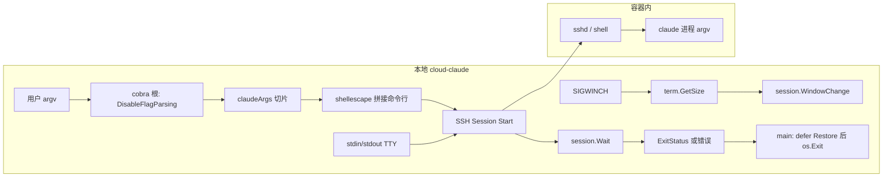

# Phase 26: 参数透传与终端体验 - Research

**Researched:** 2026-04-15  
**Domain:** Go CLI（cobra）、SSH PTY、终端信号与退出码透传  
**Confidence:** HIGH

## Summary

本阶段在 Phase 25 已实现的「单 PTY + `claude` 固定命令」之上，把 **cobra 根命令改为透传用户 argv**（等价于本地 `claude` 的参数），在远端用 **单次 `session.Start(远程命令行)`** 启动 Claude Code，并对每个参数做 **POSIX shell 级转义** 以避免注入。`golang.org/x/crypto/ssh` 的 `Session.WindowChange` 与 `SIGWINCH` 组合已在当前 `ssh.go` 中落地，本阶段以复核与跨平台说明为主。`Ctrl+C` / `Ctrl+\` 在 **终端 raw 模式** 下以字节序列经 SSH channel 到达远端，与「向本进程发 SIGINT 再转发」是两条路径——与 26-CONTEXT 中 D-04 一致。Phase 25 审查中的 **HI-01**（`os.Exit` 跳过 `defer term.Restore`）必须通过 **将远程退出码返回 `main`，在 `defer Restore` 之后统一 `os.Exit`** 修复，才能同时满足 TTY-03 与终端恢复。

**Primary recommendation：** 根命令 `DisableFlagParsing: true` + `Args: cobra.ArbitraryArgs`；`ConnectAndRunClaude(cfg, claudeArgs []string)` 内用 `shellescape.QuoteCommand`（或等价）拼 `claude` + args；`session.Wait` 仅返回 `*ssh.ExitError` 的 `ExitStatus()`，由 `main` 退出；非 TTY 路径跳过 PTY/raw/SIGWINCH。

## Architectural Responsibility Map

| Capability | Primary Tier | Secondary Tier | Rationale |
|------------|----------------|----------------|-----------|
| 收集并保留用户 claude 参数 | 本地 CLI（cobra 根命令） | — | 必须在客户端完成解析策略，远端只执行拼接后的命令行 |
| 构造安全远程 shell 命令行 | 本地 CLI（`internal/cloudclaude`） | — | 防注入属于客户端责任；SSH 仅传输字符串 |
| PTY 申请、stdin/stdout 桥接 | 本地 CLI（SSH session） | — | `x/crypto/ssh` 在客户端驱动 |
| 窗口尺寸同步（SIGWINCH → `WindowChange`） | 本地 CLI（SSH session + `x/term`） | — | 宿主机捕获信号并通知 sshd |
| 远程进程退出码 | 本地 CLI（解析 `ssh.ExitError`） | — | 与 Entry/网关无关 |

## Standard Stack

### Core

| Library | Version | Purpose | Why Standard |
|---------|---------|---------|----------------|
| `github.com/spf13/cobra` | v1.10.2 [VERIFIED: `go list -m github.com/spf13/cobra`] | 根命令透传参数、`init` 子命令独立解析 flag | 项目已用；`DisableFlagParsing` 官方语义明确 [CITED: cobra `command.go` 注释] |
| `golang.org/x/crypto/ssh` | v0.37.0（与 `go.mod` 一致）[VERIFIED: `go.mod`] | `Session`、`RequestPty`、`WindowChange`、`Wait`/`ExitError` | Go 生态事实标准 SSH 客户端实现 |
| `golang.org/x/term` | v0.42.0 [VERIFIED: `go.mod`] | `IsTerminal`、`GetSize`、`MakeRaw`/`Restore` | 与 `x/crypto/ssh`、PTY 流程配套 |

### Supporting

| Library | Version | Purpose | When to Use |
|---------|---------|-----------|-------------|
| `al.essio.dev/pkg/shellescape`（或 `github.com/alessio/shellescape` 旧 import） | 规划执行前以 `go list -m` 锁定（pkg 文档默认展示 v1.6.0） [CITED: https://pkg.go.dev/al.essio.dev/pkg/shellescape] | `Quote` / `QuoteCommand`，拼接 `claude arg1 arg2 ...` | 任意用户参数含空格、`'`、`$` 等时必须使用，禁止手写拼接 |

### Alternatives Considered

| Instead of | Could Use | Tradeoff |
|------------|-----------|----------|
| `shellescape` | 手写转义或仅 `strconv.Quote` | 易漏边界情况，审计成本高；不推荐 [ASSUMED: 与 POSIX shell 规则差异] |
| `DisableFlagParsing` | 为每个 claude flag 在 cobra 注册别名 | 维护量随上游 CLI 爆炸，与「与本地 claude 一致」目标冲突 |

**Installation（新增 shellescape 时）：**

```bash
go get al.essio.dev/pkg/shellescape@latest
go mod tidy
```

**Version verification：** 对 Go 模块使用 `go list -m -versions <module>` / `go list -m all`；本阶段核心依赖版本已在仓库 `go.mod` 中锁定。

<user_constraints>
## User Constraints（来自 `26-CONTEXT.md`）

### Locked Decisions

#### 参数解析与透传

- **D-01:** 根命令使用 cobra 的 `Args: cobra.ArbitraryArgs` 和 `DisableFlagParsing: true`（或 `TraverseChildren: false`），确保 `cloud-claude -p "prompt" --model opus` 的 `-p`、`--model` 等 flag 不被 cobra 拦截，而是完整传入 `args []string`。`init` 子命令仍正常解析自身 flag。
- **D-02:** 远程命令构建方式：将 `args` 拼接为 `claude <arg1> <arg2> ...`，每个 arg 使用 `shellescape` 或手写引号转义以防注入。通过 `session.Start(cmdLine)` 发送到远程 shell。
- **D-03:** 若用户 `cloud-claude -- -p "prompt"` 使用双横线分隔，cobra 在 `DisableFlagParsing` 模式下会保留 `--`，需在构建远程命令时剥离前导 `--`。

#### 信号转发

- **D-04:** 当终端处于 raw mode 时，Ctrl+C 和 Ctrl+\ 生成的字节序列直接经 SSH stdin channel 发送到远程，**无需** Go 侧拦截 SIGINT/SIGQUIT 后主动转发——raw mode 下 OS 不会向本进程发送这些信号，而是作为普通字节传到 session.Stdin。
- **D-05:** SIGWINCH 已在 Phase 25 实现（`session.WindowChange`），本阶段复核其在多 OS 下的行为即可。若 macOS/Linux 差异影响窗口变化检测，补充 `SIGWINCH` fallback 或 polling。

#### 退出码与 TTY 恢复

- **D-06:** 修复 Phase 25 代码审查 HI-01：`ssh.ExitError` 时 `os.Exit()` 会跳过 `defer term.Restore`，导致本地终端停留在 raw mode。方案：将退出码通过返回值传递到 `main`，由 `main` 在 `defer Restore` 完成后再 `os.Exit`。
- **D-07:** 退出码映射：远程 `claude` 的退出码直接作为 `cloud-claude` 的退出码；SSH 连接断开等异常使用 Phase 25 已有的 `exitInternalError (5)` 退出码。

#### 非 TTY 模式

- **D-08:** 当 stdin 不是终端时（如管道 `echo "query" | cloud-claude -p -`），跳过 raw mode、PTY 申请和 SIGWINCH 监听，直接以非交互方式运行远程命令。这使 `cloud-claude` 可被脚本调用。

### Claude's Discretion

- shellescape 库选择（标准库方案或三方包）。
- 是否对 `claude --help` 等 flag 做本地短路（不影响 MVP，可延后）。
- 远程命令路径是 `claude` 还是绝对路径（依赖受管镜像 PATH 配置）。

### Deferred Ideas（OUT OF SCOPE）

- sshfs slave 与当前目录映射 — Phase 27
- `claude --help` 本地短路 — 可在后续 polish 阶段添加
- SSH 主机密钥钉扎 — 延续 Phase 25 决策，暂不实现
</user_constraints>

<phase_requirements>
## Phase Requirements

| ID | Description | Research Support |
|----|-------------|------------------|
| CLI-03 | 用户传入的所有 claude 参数原样透传到容器内 Claude Code | cobra `DisableFlagParsing` + `RunE` 的 `args`；`session.Start` 拼接转义后的命令行 [CITED: cobra 源码注释] |
| TTY-01 | 终端 resize 时 SIGWINCH 正确传递到容器内进程 | `signal.Notify` + `session.WindowChange(h,w)` [VERIFIED: `go doc golang.org/x/crypto/ssh.Session.WindowChange`] |
| TTY-02 | Ctrl+C / Ctrl+\ 等到远端 | raw 模式下字节走 stdin；与 D-04 一致 [ASSUMED: 与 OpenSSH 交互会话行为一致，需在目标 OS 上验证] |
| TTY-03 | 容器内退出码透传到本地 | `*ssh.ExitError` + `ExitStatus()` 返回至 `main` [VERIFIED: `go doc golang.org/x/crypto/ssh.ExitError` / `Waitmsg.ExitStatus`] |
</phase_requirements>

## Project Constraints（来自仓库约定）

- 仓库根目录**无** `.cursor/rules/` 目录；无额外项目级 rule 文件需逐条摘录。
- `CLAUDE.md` / `CONVENTIONS.md`：面向用户的说明默认中文；禁止在 git 跟踪内容中写入本机绝对路径与真实密钥。

## Architecture Patterns

### System Architecture Diagram



### Recommended Project Structure

```
cmd/cloud-claude/
└── main.go              # 根命令 cobra 配置；收集 args；统一 os.Exit(远程码)
internal/cloudclaude/
├── ssh.go               # ConnectAndRunClaude(cfg, args)；PTY/raw/SIGWINCH/非TTY 分支；返回 exit code
└── ...                  # 其余不变
```

### Pattern 1：cobra 透传 flag 给子进程

**What：** 对根命令设置 `DisableFlagParsing: true`，使「看起来像 flag」的 token 全部进入 `args`。  
**When to use：** 本仓库根命令代理另一 CLI（`claude`）时。  
**Example：**

```go
// Source: [CITED: https://github.com/spf13/cobra/blob/main/command.go — 字段注释]
// DisableFlagParsing disables the flag parsing.
// If this is true all flags will be passed to the command as arguments.
rootCmd := &cobra.Command{
    Use: "cloud-claude",
    DisableFlagParsing: true,
    Args: cobra.ArbitraryArgs,
    RunE: runRoot,
}
```

### Pattern 2：远程退出码上浮且不破坏 defer

**What：** `ConnectAndRunClaude` 返回 `(exitCode int, err error)` 或自定义 `type ExitCoder`，**禁止**在 `ssh.go` 内对远程成功/失败调用 `os.Exit`。  
**When to use：** 任意在 `term.MakeRaw` 之后需要恢复终端的路径。  
**Example：**

```go
// Source: [VERIFIED: go doc golang.org/x/crypto/ssh.ExitError / Waitmsg.ExitStatus]
if ee, ok := err.(*ssh.ExitError); ok {
    return ee.ExitStatus(), nil // 由 main 在 Restore 后 os.Exit(code)
}
```

### Anti-Patterns to Avoid

- **在 library 内 `os.Exit`：** 跳过 `defer term.Restore`（HI-01），违反 TTY 与脚本体验。
- **未转义的用户参数拼进 `session.Start`：** 构成命令注入面（见 Security）。
- **非 TTY 仍申请 PTY：** 与 D-08 冲突，且可能扭曲管道/脚本行为。

## Don't Hand-Roll

| Problem | Don't Build | Use Instead | Why |
|---------|-------------|-------------|-----|
| Shell 元字符转义 | 自己维护转义表 | `shellescape.Quote` / `QuoteCommand` [CITED: pkg.go.dev] | 引号、`$`、换行等边界易错 |
| SSH 远程退出码 | 字符串解析 stderr | `*ssh.ExitError` + `ExitStatus()` [VERIFIED: go doc] | 协议层已携带 |
| 终端列行更新 | 轮询终端尺寸（首选） | `SIGWINCH` + `WindowChange`（已实现） | 与标准 SSH 客户端行为一致 |

**Key insight：** 透传的核心矛盾是「cobra 的 UX」与「远程 shell 一条字符串」之间的桥接；转义是安全关键路径，应使用成熟库并在测试中覆盖恶意/怪异参数。

## Common Pitfalls

### Pitfall 1：远程非零退出后本地终端仍 raw

**What goes wrong：** 用户 shell 回显乱、需 `reset`。  
**Why it happens：** `os.Exit` 不执行 defer（HI-01）。  
**How to avoid：** D-06：退出码以返回值交给 `main`。  
**Warning signs：** 仅在远程 `claude` 以非零退出时复现。

### Pitfall 2：误以为要在 Go 里转发 SIGINT

**What goes wrong：** 重复处理或与 raw 模式字节流冲突。  
**Why it happens：** 混淆「终端 cooked 模式发信号」与「raw 模式读字节」。  
**How to avoid：** 遵循 D-04；交互路径保持 raw + 直连 `session.Stdin`。  
**Warning signs：** 在 `signal.Notify(SIGINT)` 里写转发逻辑且与 PTY 重复。

### Pitfall 3：Windows / 非 POSIX 宿主

**What goes wrong：** `SIGWINCH` 或终端尺寸 API 行为与 Linux 不一致。  
**Why it happens：** 产品声明 Windows 通过 WSL；原生 Windows 控制台不同。  
**How to avoid：** 在范围内仅支持 macOS/Linux（及 WSL）；其余显式降级或文档说明。  
**Warning signs：** 在 Windows 原生 `cmd` 下测试 resize。

### Pitfall 4：前导 `--` 与远程 argv

**What goes wrong：** 远端收到多余 `--`，与本地 `claude` 行为不一致。  
**Why it happens：** D-03 所述 cobra 可能保留 `--`。  
**How to avoid：** 构建 `claudeArgs` 时剥离仅用于分隔的 `--`（需写单测覆盖）。  
**Warning signs：** `cloud-claude -- --help` 与预期不符。

## Code Examples

### 拼接远程命令（示意）

```go
// Source: [CITED: https://pkg.go.dev/al.essio.dev/pkg/shellescape — QuoteCommand]
import "al.essio.dev/pkg/shellescape"

remoteCmd := shellescape.QuoteCommand(append([]string{"claude"}, userArgs...))
// session.Start(remoteCmd)
```

### WindowChange（与当前实现一致）

```go
// Source: [VERIFIED: go doc golang.org/x/crypto/ssh.Session.WindowChange]
_ = session.WindowChange(h, w) // h rows, w columns per doc
```

## State of the Art

| Old Approach | Current Approach | When Changed | Impact |
|--------------|------------------|--------------|--------|
| 固定 `session.Start("claude")` | `Start(escaped "claude ...")` | Phase 26 | 满足 CLI-03 |
| 在 SSH 层 `os.Exit` | 返回码 + `main` 退出 | Phase 26 | 修复 HI-01，满足 TTY-03 |

**Deprecated/outdated：** 无额外过时库；cobra 1.10.x 仍为当前依赖。

## Assumptions Log

| # | Claim | Section | Risk if Wrong |
|---|-------|---------|---------------|
| A1 | 容器内默认 shell 对 `shellescape` 所用 POSIX 单引号规则兼容 | Standard Stack / Don't Hand-Roll | 极端 login shell 配置下行为偏差；可改为显式 `exec` 路径 |
| A2 | `DisableFlagParsing` 下 `--` 仍出现在 `args` 中且需剥离 | User Constraints D-03 | 双横线处理错误导致远端参数不一致；需单测验证 |
| A3 | 非 PTY 模式下不配 PTY 即可支持管道输入且远端 `claude` 行为可接受 | D-08 | 若远端强依赖 TTY，需调整策略 |

**若上表需在执行前归零：** 在计划阶段对 A2 写探测用例；对 A1 在镜像中确认 `/bin/sh`/`bash` 与 `QuoteCommand` 输出。

## Open Questions

1. **`DisableFlagParsing` 时 `cloud-claude -- -p` 的 `args` 精确形态？**
   - What we know：D-03 要求剥离前导 `--`。  
   - What's unclear：cobra/pflag 是否保留单独的 `"--"` token。  
   - Recommendation：在 Wave 0 增加单元测试对 `rootCmd.SetArgs` 探测，再写剥离逻辑。

2. **远端 `exec` 是否经 login shell 解释命令串？**
   - What we know：OpenSSH `ForceCommand` 与用户 shell 会改变行为；当前为默认 `session.Start` 字符串。  
   - What's unclear：镜像 sshd 是否对 command 强制 `/bin/sh -c`。  
   - Recommendation：在规划任务中加「与 Phase 24/25 镜像一致」的集成验证一条。

## Environment Availability

| Dependency | Required By | Available | Version | Fallback |
|------------|-------------|-----------|---------|----------|
| Go toolchain | 构建 / 测试 | ✓ | go1.25.7 darwin/arm64 [VERIFIED: 本机 `go version`] | — |
| UNIX 终端 + SIGWINCH | TTY-01/02 | ✓（macOS 本会话） | — | Linux CI；Windows 仅 WSL |
| `proxy.golang.org` | 拉取新模块 | 部分命令曾 EOF [VERIFIED: 本会话 `go list` 失败] | — | 重试 / 直连源站 / 离线 vendor |

**Step 2.6 note：** 本阶段无独立守护进程依赖；SSH 目标为远端容器，开发机无需本地 sshd。

## Validation Architecture

> **Skipped：** `.planning/config.json` 中 `workflow.nyquist_validation` 为 `false`，按项目约定本文件不包含 Nyquist / 测试矩阵章节。

## Security Domain

### Applicable ASVS Categories

| ASVS Category | Applies | Standard Control |
|---------------|---------|------------------|
| V2 Authentication | no | — |
| V3 Session Management | no | — |
| V4 Access Control | no | — |
| V5 Input Validation | yes | 远程命令拼接前对每个参数做 shell 转义；禁止将未转义字符串拼入 `session.Start` |
| V6 Cryptography | no | — |

### Known Threat Patterns（本阶段）

| Pattern | STRIDE | Standard Mitigation |
|---------|--------|---------------------|
| 命令注入（恶意参数含 `;`、`$()` 等） | Tampering | `shellescape.Quote` / `QuoteCommand` [CITED: pkg.go.dev] |
| 终端逃逸序列滥用 | Tampering | 信任 claude 与远端 TTY；本阶段不扩展终端仿真 |

## Sources

### Primary（HIGH confidence）

- [VERIFIED: 本地模块] `github.com/spf13/cobra@v1.10.2` — `command.go` 字段 `DisableFlagParsing` 注释与 `execute` 分支  
- [VERIFIED: `go doc`] `golang.org/x/crypto/ssh` — `Session.WindowChange`、`ExitError`、`Waitmsg.ExitStatus()`  
- [VERIFIED: `go.mod` / `go list -m`] 本项目锁定的 `cobra`、`golang.org/x/crypto`、`golang.org/x/term` 版本  

### Secondary（MEDIUM confidence）

- [CITED: https://pkg.go.dev/al.essio.dev/pkg/shellescape] — `Quote` / `QuoteCommand` 语义与推荐用法  
- [CITED: `.planning/phases/25-cloud-claude-cli/25-REVIEW.md`] — HI-01 与修复方向  

### Tertiary（LOW confidence）

- [ASSUMED] 各 OS 上 raw 模式与 SSH 交互会话对 `^C` / `^\\` 的字节路径 — 需集成测试确认  

## Metadata

**Confidence breakdown:**

- Standard stack: **HIGH** — 版本与 API 均可在本机验证  
- Architecture: **HIGH** — 与 26-CONTEXT 与现有代码路径一致  
- Pitfalls: **MEDIUM** — `--` 剥离与远端 shell 行为需测试加固  

**Research date:** 2026-04-15  
**Valid until:** ~2026-05-15（cobra/ssh 小版本升级时复核）
